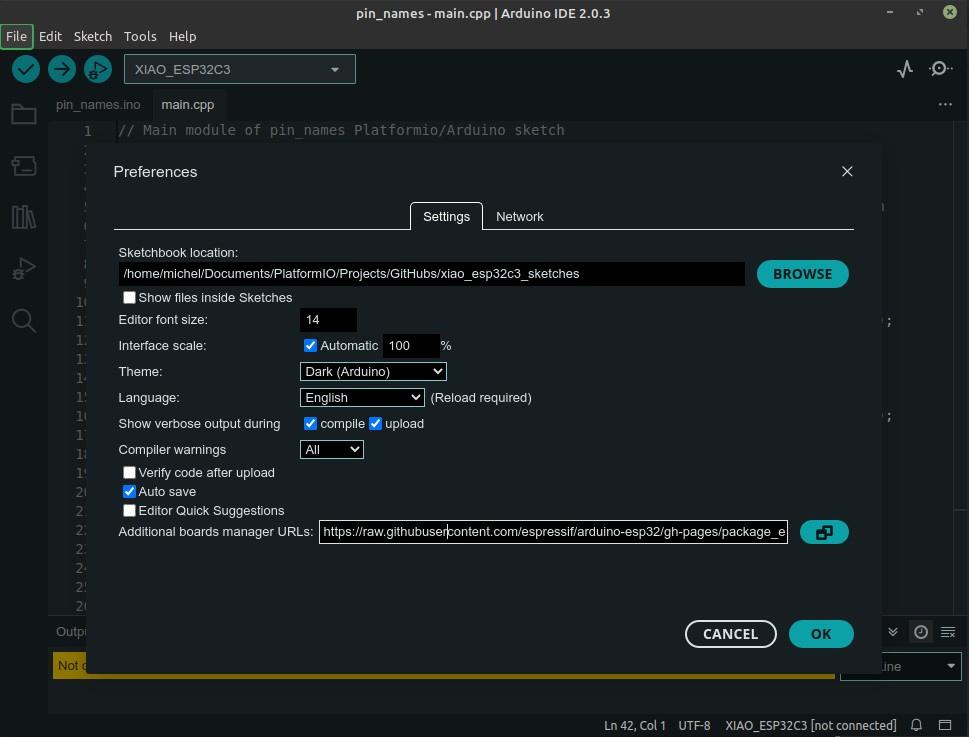

# XIAO ESP32C3 Arduino Sketches / PlatformIO Projects

**Source code that accompanies the February 2023 version of [First Look at the Seeed Studio XIAO ESP32C3](https://sigmdel.ca/michel/ha/xiao/xiao_esp32c3_intro_en.html)**.

 

## Introduction

The XIAO ESP32C3 is a recent addition to the Seeed Studio XIAO series of diminutive development boards. It is based on the Espressif ESP32-C3 SoC which, unlike other Espressif microcontrollers, has a RISC-V core.

It should be possible to compile each project with PlatformIO, and with currently one exception, in the Arduino IDE and then upload them to the XIAO. There should be no unresolved dependencies. In other words, there should not be any need to install anything other than this repository. To make these sketches self-contained, private copies of all third-party libraries are included. Where a private library is included, only the necessary files were added. Please obtain the full library from the original source if it is to be used in another project.

## Arduino IDE Notes

Arduino sketches must have an `.ino` file name extension and must be contained in a directory that has the same name as the Arduino sketch (excluding the extension). Consequenty the `01_pin_names` project containts a directory named `pin_names` that in turn contains the Arduino sketch `pin_names.ino`. That sketch is basically empty as it is a long comment only. This is not a problem because the Arduino IDE will import all source files found in the sketch directory. The actual code is in `main.cpp` which is the default name of a PlatformIO project.

 

To compile and then upload the sketch in the Arduino IDE, click on the **File** top menu, click on **Open...**, then navigate to the `pin_names.ino` file and open it with the system file manager.

Private libraries are stored in the subdirectory `xiao_esp32c3_sketches/libraries`.  The Arduino IDE will find libraries in that directory if the Sketchbook location in the Arduino Preferences is set to the parent directory, `xiao_esp32c3_sketches`.



Do keep track of the previous sketchbook location to be able to restore it after compiling and uploading the sketches in this repository.

Following the instructions in [Installing using Arduino IDE](https://docs.espressif.com/projects/arduino-esp32/en/latest/installing.html#installing-using-arduino-ide) the development release of the Arduino-ESP32 framework was installed by entering the following URL 
```
https://raw.githubusercontent.com/espressif/arduino-esp32/gh-pages/package_esp32_dev_index.json
```
into the `Additional Board Manager URLs` field of the Arduino Preferences.


## PlatformIO Notes

Because of the Arduino sketch naming constraints, the `main.cpp` file of a project is not stored in the `src` directory. To work around this change, a `src_dir` entry is added in the `platformio.ini` file to provide the name of the directory in which `main.cpp` is found. That will be the name of the Arduino sketch as shown here for the `01_pin_names` project. 

```ini
[platformio]
; Make the Arduino IDE happy (.INO file must be in a directory of the same name)
src_dir = pin_names
```

 PlatformIO will "convert" the Arduino sketch, but that is of no consequence since it contains only comments.

The USB ID of some recent, if not most, XIAO ESP32C3 boards is 0x303A:1001 which is not contained in the `hwids` array the board definition in the 6.0.1 release of `platform-espressif32`. Because the current code repository has added the needed USB ID, the `develop` branch of `platform-espressif32` is specified in the configuration file.

```ini
platform = https://github.com/platformio/platform-espressif32.git#develop
```

If one prefers to use the current stable branch or an older version, then the upload and monitor port will have to be specified explicitly.

```ini
platform = espressif32
upload_port = /dev/ttyACM0
monitor_port = /dev/ttyACM0
```

In Windows or MacOS the name of the port will be different, of course, and even in Linux, the device name will be different if `/dev/ttyACM0` is already in use when the XIAO is connected to the USB port. 

## List of Projects      

| Project | Section in *First Look...* |
| ---     | ---                           |
| **01_pin_names** | [8. Pin Numbers](https://sigmdel.ca/michel/ha/xiao/xiao_esp32c3_intro_en.html#pins) |
| **02_blink_led** | [9. At Last, the XIAO ESP32C3 Blinks](https://sigmdel.ca/michel/ha/xiao/xiao_esp32c3_intro_en.html#blink) |
| **03_button_led** | [10. Button Controlled LED](https://sigmdel.ca/michel/ha/xiao/xiao_esp32c3_intro_en.html#button) |
| **04_web_led** | n/a |
| **05_async_web_led** | n/a |
| **06_ble_led** | [13. Bluetooth Controlled LED](https://sigmdel.ca/michel/ha/xiao/xiao_esp32c3_intro_en.html#ble) |


## Project Notes

### 04_web_led

This project/sketch is not discussed in [First Look at the Seeed Studio XIAO ESP32C3](https://sigmdel.ca/michel/ha/xiao/xiao_esp32c3_intro_en.html). However, `04_web_led` is a C++ version of a similar MicroPython web server script described in [12. MicroPython: Web Controlled LED](https://sigmdel.ca/michel/ha/xiao/xiao_esp32c3_intro_en.html#web). In both cases, the XIAO ESP32C3 runs a Web server that makes it possible to toggle an external LED on and off through a Web interface.

### 05_async_web_led

This is the same project as 04_web_led except the `ESPAsyncWebServer` is used instead of the Web server component in `WiFi`. In trying to make this project as near to `04_web_led` as possible, no attempt was made to use the [template processing capabilities](https://github.com/me-no-dev/ESPAsyncWebServer#template-processing) of the library.

The private copies of both `ESPAsyncWebServer` and the closely tied `AsyncTCP` libraries were added for more than just ensuring that the project was self-contained. First of all, the very latest version of [ESP Async WebServer](https://github.com/me-no-dev/ESPAsyncWebServer) by me-no-dev must be used. That is because the latest stable version (1.2.3) obtained with the PIO Libraries manager is incompatible with the latest version of `md5.h`  ([reference](https://github.com/me-no-dev/ESPAsyncWebServer/issues/1147)). This can be fixed by getting the development branch or by using the [ESPAsyncWebSrv](https://github.com/dvarrel/ESPAsyncWebSrv) fork by Dam74 (dvarrel) as is done by the Arduino Library Manager. However there is another problem that seems to crop up only with the ESP32-C3 Arduino core. The `IPAddress AsyncWebSocketClient::remoteIP()` method in the `ESP Async WebServer/src/AsyncWebSocket.cpp` file must be edited. The 0 null address returned if a client is not defined must be typecast to `uint32_t` ([reference](https://github.com/me-no-dev/ESPAsyncWebServer/issues/1164)).

To ensure that PlatformIO uses the modified copies of the libraries, the `lib_dir` entry was added to `platformio.ini`.

```ini
[platformio]
; Make the Arduino IDE happy (.INO file must be in a directory of the same name)
src_dir = async_web_led
lib_dir = ../libraries
```

The source code for the [12. MicroPython: Web Controlled LED](https://sigmdel.ca/michel/ha/xiao/xiao_esp32c3_intro_en.html#web) is available here: [upy_web_led.zip]("https://sigmdel.ca/michel/ha/xiao/dnld/upy_web_led.zip").

### 06_ble_led

Unfortunately, it was not possible to get this sketch to compile without error in the Arduino IDE.


## License

Copyright 2023, Michel Deslierres. No rights reserved. 

While the copyright pertaining to included libraries must be respected, all the code by Michel Deslierres in this repository is in the public domain. In those jurisdictions where this may be a problem, the [BSD Zero Clause License](https://spdx.org/licenses/0BSD.html) applies.
