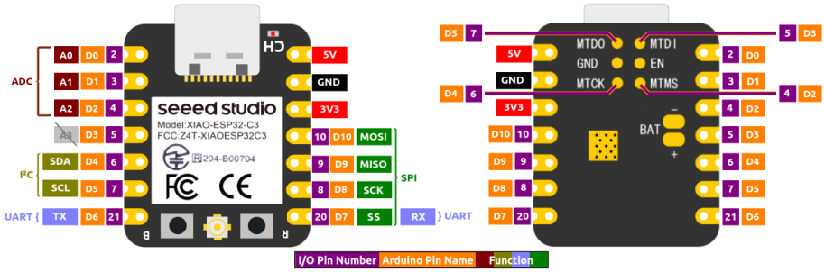
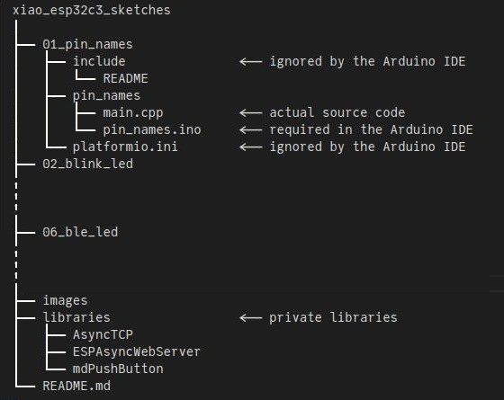

# XIAO ESP32C3 Arduino Sketches / PlatformIO Projects

**Source code that accompanies the July 2024 revision of [First Look at the Seeed Studio XIAO ESP32C3](https://sigmdel.ca/michel/ha/xiao/xiao_esp32c3_intro_en.html)**.

 


**Table of Content**
<!-- TOC -->

- [1. Introduction](#1-introduction)
- [2. Arduino IDE Notes](#2-arduino-ide-notes)
  - [2.1. Third-party libraries](#21-third-party-libraries)
- [3. PlatformIO Notes](#3-platformio-notes)
  - [3.1. Third-party libraries](#31-third-party-libraries)
- [4. List of Projects](#4-list-of-projects)
- [5. Project Notes](#5-project-notes)
- [6. Related Work](#6-related-work)
- [7. License](#7-license)

<!-- /TOC -->
## 1. Introduction

The XIAO ESP32C3 is a relatively recent addition to the [Seeed Studio XIAO series](https://www.seeedstudio.com/xiao-series-page) of diminutive development boards. It is based on the Espressif ESP32-C3 SoC which has a RISC-V core.

It should be possible to compile each project with PlatformIO or in the Arduino IDE without any need to install anything other than this repository.

## 2. Arduino IDE Notes

Arduino sketches must have an `.ino` file name extension and must be contained in a directory that has the same name as the Arduino sketch (excluding the extension). Consequenty the `01_pin_names` project containts a directory named `pin_names` that in turn contains the Arduino sketch `pin_names.ino`. That sketch is basically empty as it is a long comment only. This is not a problem because the Arduino IDE will import all source files found in the sketch directory. The actual code is in `main.cpp` which is the default name of a PlatformIO project.

 

To compile and then upload the sketch in the Arduino IDE, click on the **File** top menu, click on **Open...**, then navigate to the `pin_names.ino` file and open it with the system file manager.

### 2.1. Third-party libraries

Some sketches require third-party libraries. To make these sketches self-contained, private copies of the needed libraries are included in the [libraries](libraries/) directory. 

The Arduino IDE will find these private libraries if the `Sketchbook location` in the Arduino Preferences is set to the parent directory, `xiao_esp32c3_sketches`. Details can be found in [libraries/README.md](libraries/README.md).

Where a private library is included, only the necessary files were added. Please obtain the full library from the original source if it is to be used in another project.

## 3. PlatformIO Notes

Because of the Arduino sketch naming constraints, the `main.cpp` file of a project is not stored in the `src` directory. To work around this change, a `src_dir` entry is added in the `platformio.ini` file to provide the name of the directory in which `main.cpp` is found. That will be the name of the Arduino sketch as shown here for the `01_pin_names` project. 

```ini
[platformio]
; Make the Arduino IDE happy (.INO file must be in a directory of the same name)
src_dir = pin_names
```

PlatformIO will "convert" the Arduino sketch, but that is of no consequence since it contains only comments.

### 3.1. Third-party libraries

PlatformIO automatically downloads the needed libraries and installs them in the local `.pio/libdeps/`directory at compile time. This is because the library dependencies of each project are defined in the latter's `platformio.ini` configuration file. 

```ini
[env:seeed_xiao_esp32c3]
...
lib_deps = me-no-dev/ESP Async WebServer@^1.2.4
```

To use the private copy of the libraries included in this repository, remove or comment out the `lib_deps=` line in `platformio.ini` and replace it with  a `lib_dir=` entry.

```ini
[platformio]
src_dir = async_web_led
lib_dir = ../libraries

[env:seeed_xiao_esp32c3]
board = seeed_xiao_esp32c3
framework = arduino
platform = espressif32
monitor_speed = 460800
;lib_deps = me-no-dev/ESP Async WebServer@^1.2.4
```

## 4. List of Projects      

Except for `01_pin_names`, these projects control an external LED that is connected to one of the I/O pins of the XIAO ESP32C3.

| Project | Purpose |
| ---     | ---                           |
| **01_pin_names** | Show the content of `pins_arduino.h` |
| **02_blink_led** | Show the use of `digitalWrite` and `delay` |
| **03_button_led** | Show the use of `digitalWrite` and `digitalRead`  |
| **04_web_led** | Show the use of `WiFiServer` |
| **05_async_web_led** | Show the use of `ESPAsyncWebServer` and its [template processing capabilities](https://github.com/me-no-dev/ESPAsyncWebServer#template-processing) |
| **06_ble_led** | Show the use of the `ArduinoBLE` library |
| **07_ble_led** | Show the use of the `BLE` library contained in the ESP32 Arduino core |


## 5. Project Notes

In both `04_web_led`  and `05_web_led` the SSID and password for the Wi-Fi network must be provided in a file called `secrets.h` in the directory containing the source code. There is a model called `secrets.h.template` in the same directory that can be edited and saved under the correct name. 

It is not easy to use the `ArduinoBLE` library in the ArduinoIDE because of name conflicts with the `BLE` library included in the ESP32 Arduino core. Consequently `ArduinoBLE` is not included in the [librairies](libraries/) directory. Comments in `06_ble_led/ble_led/ble_led.ino` explain how the sketch could be compiled in the Arduino IDE, but it is suggested to skip this particular sketch and to use `07_ble_led` only in the IDE.

## 6. Related Work

There is a MicroPython web server script described in [14. MicroPython: Web Controlled LED](https://sigmdel.ca/michel/ha/xiao/xiao_esp32c3_intro_en.html#web) which is similar to the `04_web_led` project. The source is available here: [upy_web_led.zip]("https://sigmdel.ca/michel/ha/xiao/dnld/upy_web_led.zip").

It may be interesting to look at [supermini_esp32c3_sketches](https://github.com/sigmdel/supermini_esp32c3_sketches) which are about a class of slightly bigger ESP32-C3 development boards. That repository contains modified versions of projects such as `async_web_led` and `ble_led2` that can be used to investigate connectivity problems. Some Super Mini boards are known to have problems related to the circuit between the microcontroller and the onboard ceramic antenna or with the latter.

Finally, [xiao_esp32c6_sketches](https://github.com/sigmdel/xiao_esp32c6_sketches) is about the XIAO ESP32C6 which is the newest member of the XIAO series of development boards by Seeed Studio that has the ESP32-C6 RISC-V microcontroller.


## 7. License

Copyright 2023, 2024 Michel Deslierres. No rights reserved. 

While the copyright pertaining to included libraries must be respected, all the code by Michel Deslierres in this repository is in the public domain. In those jurisdictions where this may be a problem, the [BSD Zero Clause License](https://spdx.org/licenses/0BSD.html) applies.
