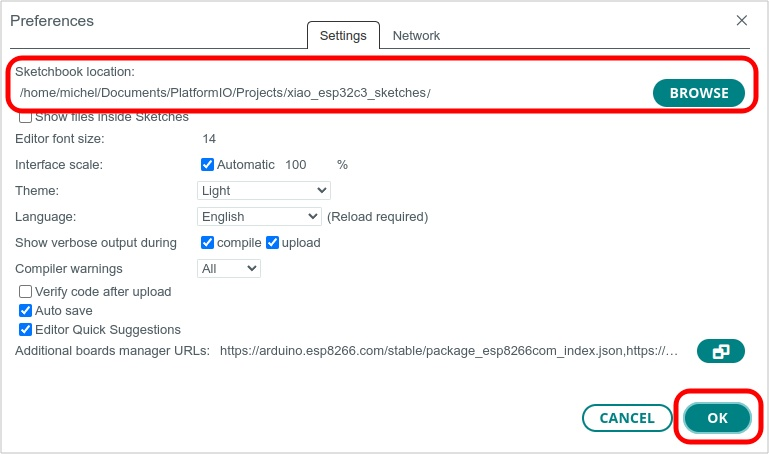

# Additional Libraries for Arduino IDE

This directory contains additional libraries needed to compile two sketches.

| Directory | Sketch | Library | Version |
| ---       | ---    | --- | --- |
| 03_button_led | button_led.ino | [mdPushButton](https://github.com/sigmdel/mdPushButton) | 0.1.3 |
| 06_async_web_led | async_web_led | [ESPAsyncWebServer](https://github.com/me-no-dev/ESPAsyncWebServer) | 1.2.4 |
| 06_async_web_led | async_web_led | [AsyncTCP](https://github.com/me-no-dev/AsyncTCP/) | 1.1.1 |
 Unfortunately, the Arduino Library Manager does not handle these needed libraries. 
Unfortunately, these libraries are not available in the Arduino Library Manager. Consequently, they are provided here. 

## Arduino IDE Configuration

These local libraries will be found and used when compiling the projects only if the sketchbook location is correctly configured in the Arduino IDE.

   1. Go to the Preferences window of the IDE: **File » Preferences**. It would be a good to jot down the previous sketchbook location beforehand in order to restore it when done with the example sketch.
   3. Enter the directory containing the `03_button_led` and `05_async_web_led` directories in  `Sketchbok location:`  
     
   4. Click on the `OK` button.

## :warning: Incomplete Libraries

Only essential elements of the three additional libraries are included; all examples and documentation have been removed. Please do not distribute these incomplete versions.

## Installing the Complete Libraries

The full library repositories can be downloaded and installed manually. First ensure that the sketchbook location is correctly configured as explained above. Delete the directories containing the incomplete libraries. Then click on the link to each of the library repository on GitHub:

  - [mdPushButton](https://github/sigmdel/mdPushButton)
  - [ESPAsyncWebServer](https://github.com/me-no-dev/ESPAsyncWebServer) 
  - [AsyncTCP](https://github.com/me-no-dev/AsyncTCP/)

In each case, click on the ``[Code]`` button and then on the `Download ZIP` button
and save the downloaded archive in the `libraries` directory alongside of this `README.md` file.

In each case, install the library manually using the Arduino IDE: **Sketch » Include library... »  Add .ZIP library...** and from there select the downloaded .ZIP archive.
